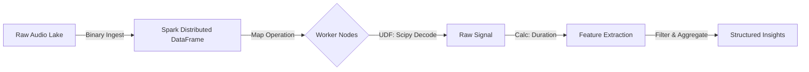

# Distributed Audio Ingestion & Analysis Pipeline

  

## Project Overview
This project implements a scalable **ETL (Extract, Transform, Load) pipeline** designed to process unstructured audio data using **Apache Spark**.

This pipeline utilizes Spark's distributed computing engine to ingest raw binary audio files, decode them in parallel using User Defined Functions, and extract metadata features (such as duration) efficiently. This architecture is designed to scale horizontally from gigabytes to terabytes of audio data.

## Architecture

The pipeline follows a standard Big Data processing flow:



## Key Technical Features
- Distributed Binary Ingestion: Utilizes Spark's binaryFile format to load audio files directly into RDDs without intermediate disk I/O bottlenecks.

- Custom UDFs (User Defined Functions): Wraps Python scientific libraries (scipy, io) within Spark workers to perform signal processing in parallel.

- Fault Tolerance: Implements error handling within the transformation stage to ensure corrupt files return null values instead of crashing the entire pipeline.

- Lazy Evaluation: Optimization of the execution plan before any compute resources are engaged.

## How to Run
1. Prerequisites
Ensure you have Java (JDK 17) and Python installed.
```bash
pip install pyspark scipy numpy
```

2. Execution
Run the pipeline submission script. The script automatically handles the download of the sample dataset (OpenSLR YesNo) if not present.
```bash
python spark_pipeline.py
```
3. Expected Output
The job provides a summary of the processed batch:

```mermaid
Pipeline Report:
========================================
Files successfully processed: 60
Average Audio Duration: 4.25 seconds
========================================
```